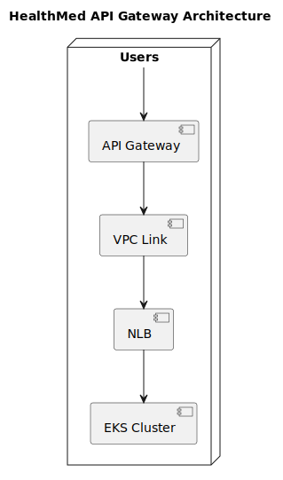

# API Gateway

This project its responsible for creating the API Gateway.

## Architecture

The following diagram shows the architecture used by this project to handle users requests.

<!-- BEGIN_TF_DOCS -->

## Requirements

| Name                                                                      | Version |
| ------------------------------------------------------------------------- | ------- |
|  [terraform](#requirement\_terraform) | 1.7.4   |
|  [aws](#requirement\_aws)                   | 5.38.0  |
## Providers

No providers.
## Inputs

| Name                                                                     | Description                                         | Type          | Default                                 | Required |
| ------------------------------------------------------------------------ | --------------------------------------------------- | ------------- | --------------------------------------- | :------: |
|  [bucket\_name](#input\_bucket\_name)    | The name of the S3 bucket to store the tfstate file | `string`      | n/a                                     |   yes    |
|  [cluster\_name](#input\_cluster\_name) | The name of the EKS cluster                         | `string`      | `"healthmed"`                           |    no    |
|  [region](#input\_region)                     | The default region to use for AWS                   | `string`      | `"us-east-1"`                           |    no    |
|  [tags](#input\_tags)                           | The default tags to use for AWS resources           | `map(string)` | <pre>{   "App": "gateway" }</pre> |    no    |
## Modules

| Name                                                      | Source            | Version |
| --------------------------------------------------------- | ----------------- | ------- |
|  [gateway](#module\_gateway) | ./modules/gateway | n/a     |
## Resources

No resources.
## Outputs

No outputs.
<!-- END_TF_DOCS -->

# License

This project is licensed under the MIT License - see the [LICENSE](LICENSE) file for details.