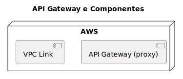

# API Gateway

Este projeto é responsável pela criação do API Gateway.

# Diagrama de Componentes

O diagrama de componentes abaixo representa de forma geral o que está sendo provisionado no projeto:



# Desenvolvimento Local

## Requisitos

- [Terraform](https://www.terraform.io/downloads.html)
- [Terraform Docs](https://github.com/terraform-docs/terraform-docs)
- [AWS CLI](https://aws.amazon.com/cli/)

## Implantação manual

### Atenção

Antes de implantar o cluster, certifique-se de definir as variáveis ​​de ambiente `AWS_ACCESS_KEY_ID` e `AWS_SECRET_ACCESS_KEY`.

Esteja ciente de que esse processo levará alguns minutos (~5 minutos) para ser concluído.

Para implantar o cluster manualmente, execute os seguintes comandos em ordem:

```bash
make init
make check # this will execute fmt, validate and plan
make apply
```

Para destruir o cluster, execute o seguinte comando:

```bash
make destroy
```

## Implantação Automatizada

A implantação automatizada é acionada por uma GitHub Action.

# Provisionamento

<!-- BEGIN_TF_DOCS -->

## Requirements

| Name                                                                      | Version |
| ------------------------------------------------------------------------- | ------- |
| <a name="requirement_terraform"></a> [terraform](#requirement\_terraform) | 1.7.4   |
| <a name="requirement_aws"></a> [aws](#requirement\_aws)                   | 5.38.0  |
## Providers

No providers.
## Inputs

| Name                                                                     | Description                                         | Type          | Default                                 | Required |
| ------------------------------------------------------------------------ | --------------------------------------------------- | ------------- | --------------------------------------- | :------: |
| <a name="input_bucket_name"></a> [bucket\_name](#input\_bucket\_name)    | The name of the S3 bucket to store the tfstate file | `string`      | n/a                                     |   yes    |
| <a name="input_cluster_name"></a> [cluster\_name](#input\_cluster\_name) | The name of the EKS cluster                         | `string`      | `"healthmed"`                           |    no    |
| <a name="input_region"></a> [region](#input\_region)                     | The default region to use for AWS                   | `string`      | `"us-east-1"`                           |    no    |
| <a name="input_tags"></a> [tags](#input\_tags)                           | The default tags to use for AWS resources           | `map(string)` | <pre>{<br>  "App": "gateway"<br>}</pre> |    no    |
## Modules

| Name                                                      | Source            | Version |
| --------------------------------------------------------- | ----------------- | ------- |
| <a name="module_gateway"></a> [gateway](#module\_gateway) | ./modules/gateway | n/a     |
## Resources

No resources.
## Outputs

No outputs.
<!-- END_TF_DOCS -->

# Licença

Este projeto é licenciado sob a Licença MIT - veja o arquivo [LICENSE](LICENSE) para detalhes.